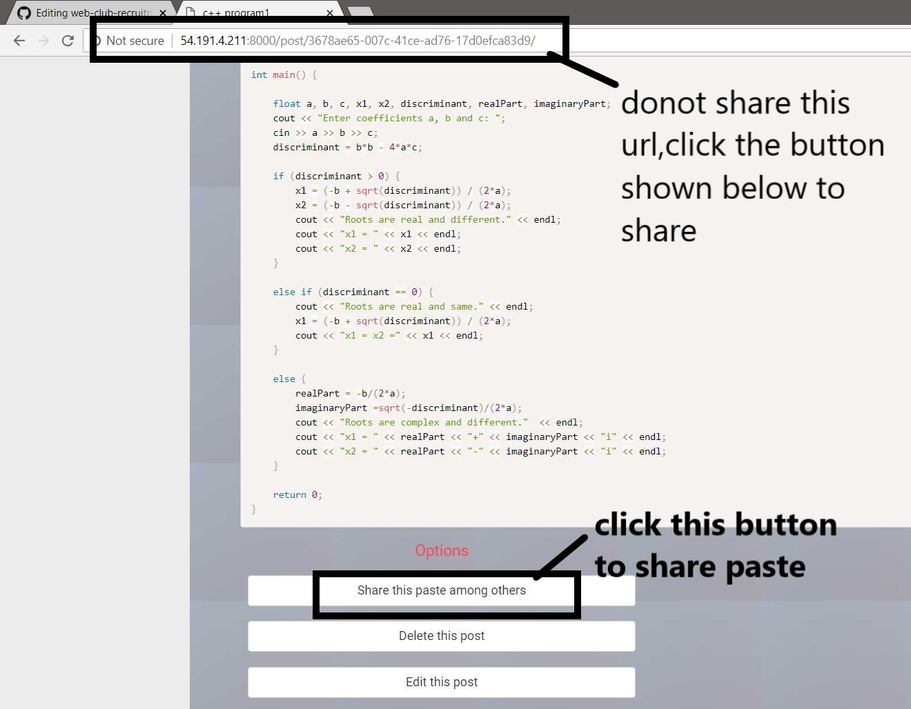

Paste It website description:- 

url of the live website- http://54.191.4.211:8000/home/ 
link of video describing features of Paste It website - https://drive.google.com/file/d/1PUVhnnOXEJk7ftNuazsQQumUhR5b_ac2/view 
link of project folder on drive - https://drive.google.com/drive/folders/1tQQ9b0YpJOPIGq93QKu8Re1dnLDJrCBS <

usage instructions-
1.If you are new member then first signup to use the website. 
2.after you sign in in the userpage you will see the box where you can create a new paste. 
3.you can select a paste title , syntax highlighting(for programming languages), expiration time of post and set the edit permission. 
4. if the edit permission is no then no one (user or any anonymous person) can edit the post but when it is turned on the user can edit his post directly and apply the changes. Where as if a anonymous person tries to edit a post , the original post would not be edited but a different share url will be generated which will allow the random user to share his piece of edited code also. 
5.DONOT SHARE THE URL OF THE POST WHICH IS GENERATED AFTER YOU HIT CREATE PASTE BUTTON(AS GIVEN IN POINT 2). THAT URL IS FOR YOUR USAGE ONLY. IF YOU WANT TO SHARE THE PASTE AMONG YOUR FRIENDS THEN CLICK "SHARE" BUTTON ON THAT PAGE WHICH WILL CREATE A RANDOM SHARE URL WHICH YOU CAN SHARE AMONG YOUR FRIENDS.  
6.Please signout after every session. 

 limitations-
 1.If a user shares the url of the paste which is generated after clicking paste it button and the user hasnot signed out of the system yet, then any anonymous person who gets that link can directly access the user's account. Therefore to prevent it I have added the SHARE POST option using which the user can safely generate a random url and share it between his friends . Using that url anonymous persons can only see the psate and the user's account remains safe from the anonymous person . 
